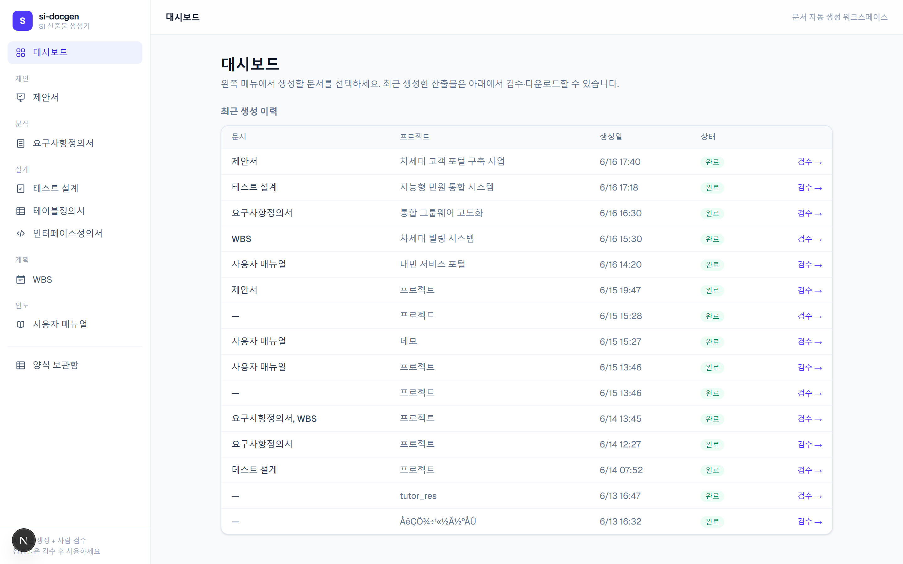
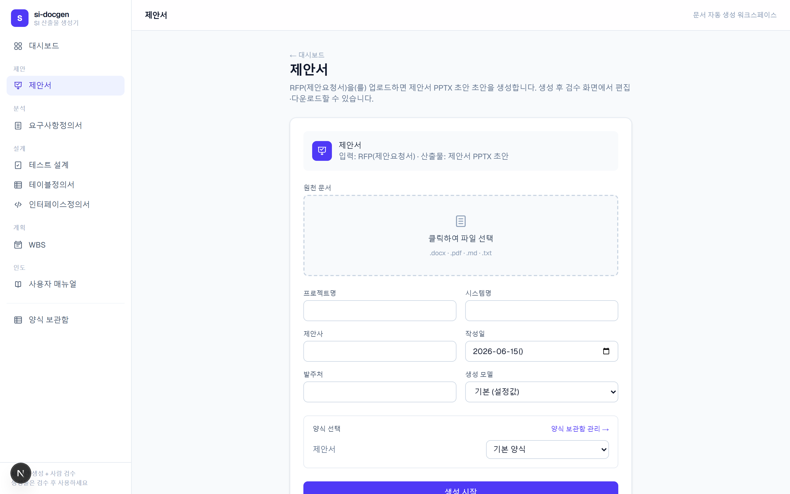
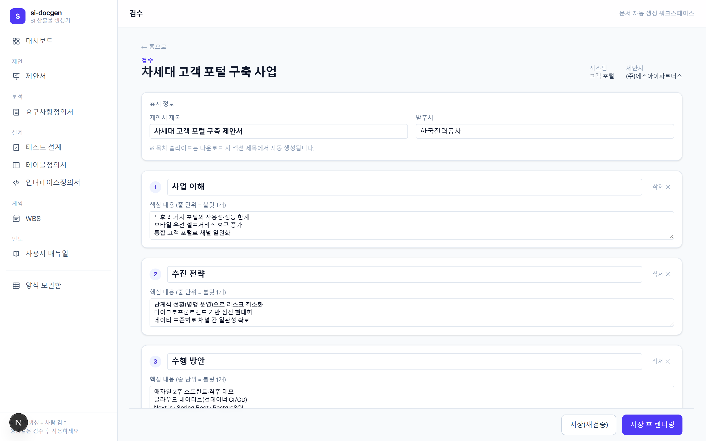
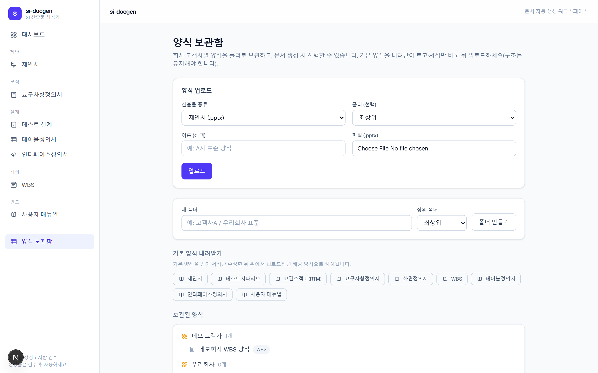

# si-docgen

**한국 SI 프로젝트의 표준 산출물을 LLM으로 초안 생성하고, 사람이 검수해 고객사 양식 그대로 내려받는 웹 애플리케이션.**

RFP·요구사항정의서·회의록 같은 원천 문서를 올리면, LLM이 구조화된 데이터를 만들고 결정론적 렌더러가 **고객사 양식(.docx / .xlsx / .pptx)을 보존한 채** 값만 채워 산출물을 생성합니다. 완전 자동화가 아니라 **"AI 초안 생성 + 사람 검수 게이트"** 모델입니다.



---

## 왜 만들었나

SI 프로젝트의 산출물은 양이 많고 형식이 정해져 있지만, 내용은 매번 새로 써야 합니다. 그렇다고 LLM에게 통째로 맡기면 ① 양식(테두리·병합·결재란·폰트)이 깨지고 ② 환각으로 신뢰할 수 없는 문서가 나옵니다.

si-docgen은 역할을 분리해 이 문제를 풉니다.

- **LLM은 JSON만 생성** — 파일을 직접 만들지 않습니다.
- **렌더러는 순수 함수** — 검증된 데이터와 템플릿을 받아 값만 주입합니다. 양식은 템플릿의 책임입니다.
- **모든 LLM 출력은 Pydantic 스키마 검증**을 통과해야 하며, 실패 시 최대 3회 재시도합니다.
- **사람이 검수**한 뒤에야 최종 파일로 렌더링됩니다.

---

## 주요 기능

### 문서별 생성 메뉴

SI 단계(제안 → 분석 → 설계 → 계획 → 인도)에 맞춰 산출물별 메뉴를 제공합니다. 각 메뉴는 독립적으로 동작하며, 원천 문서를 올리면 해당 산출물 초안이 생성됩니다.

| 산출물 | 입력 | 출력 | 비고 |
|---|---|---|---|
| 제안서 | RFP(제안요청서) | `.pptx` | 표준 8개 섹션 + 목차 자동 생성 |
| 요구사항정의서 | RFP·회의록 등 | `.docx` | 개정 이력·요건 상세 반복 |
| 테스트 설계 | 요구사항정의서 | `.xlsx` + `.pptx` | 화면정의서 + 테스트시나리오 + RTM (추적성 유지) |
| 테이블정의서 | 요구사항정의서 | `.xlsx` | 테이블·컬럼·PK/FK |
| 인터페이스정의서 | 요구사항정의서 | `.xlsx` | 송수신 시스템·연계 방식·메시지 항목 |
| WBS | 요구사항정의서 | `.xlsx` | 계층 번호·일정·공수 (렌더러가 계산) |
| 사용자 매뉴얼 | 요구사항·화면정의서 | `.docx` | 화면 캡처 이미지 삽입 |

### RFP → 제안서 자동 초안

RFP를 올리면 표준 SI 제안 목차(사업 이해·추진 전략·수행 방안·일정·조직·품질/보안·기대 효과·결론)로 제안서 PPTX 초안을 생성합니다. **목차 슬라이드는 렌더러가 섹션 제목에서 자동 생성**하므로 본문과 항상 일치합니다.



### 검수 게이트 — 편집 후 재렌더링

생성된 초안은 검수 화면에서 표/슬라이드 단위로 편집할 수 있습니다. 편집본은 다시 스키마 검증을 거친 뒤 최종 파일로 렌더링되어 다운로드됩니다.



### 양식 보관함

회사·고객사별 양식을 폴더 트리로 보관하고, 문서 생성 시 선택할 수 있습니다. 선택하지 않으면 기본 양식으로 생성됩니다. 업로드 시 기본 양식과 **구조가 호환되는지 검증**(엑셀=시트명, 워드=치환 태그, PPT=도형명)하여 서식만 바꾼 양식만 통과시킵니다.



### ID 추적성 (REQ → SCR → TC)

요건 ID(REQ) → 화면 ID(SCR) → 테스트케이스 ID(TC)의 참조 관계를 스키마 레벨에서 강제합니다. 존재하지 않는 ID를 참조하면 검증 단계에서 실패 처리되어, 산출물 간 정합성이 깨지지 않습니다.

---

## 빠른 시작

### 사전 준비

- Python 3.12+ / [uv](https://docs.astral.sh/uv/)
- Node.js + [pnpm](https://pnpm.io/)(corepack)
- LLM: 로컬 [Ollama](https://ollama.com/) 또는 상용 모델(Anthropic 등) — LiteLLM 형식

### 백엔드

```bash
uv sync                                  # 의존성 설치
cp .env.example .env                     # 모델 등 설정 (SIDOCGEN_LLM_MODEL)
uv run alembic -c alembic.ini upgrade head   # DB 스키마 생성 (기본 SQLite)
uv run uvicorn app.api.main:app --app-dir backend --port 8000
```

### 프론트엔드

```bash
corepack pnpm -C frontend install
corepack pnpm -C frontend dev            # http://localhost:3000
```

### CLI (웹 없이 단독 생성)

```bash
# RFP → 제안서
uv run si-docgen proposal --input rfp.docx --output ./out --client 한국전력공사

# 요구사항정의서 → 화면정의서 + 테스트시나리오 + RTM (추적성 체인)
uv run si-docgen generate --input requirements.docx --output ./out --with-screens

# 요구사항정의서 → WBS
uv run si-docgen wbs --input requirements.docx --output ./out --start-date 2026-07-01
```

> 모델명은 설정(`.env`의 `SIDOCGEN_LLM_MODEL`)에서만 관리합니다. 단계별로 다른 모델을 쓰려면 `SIDOCGEN_PROPOSAL_MODEL` 등으로 오버라이드할 수 있습니다.

---

## 아키텍처

```
원천 문서 ──► 파서 ──► LLM(JSON 생성) ──► Pydantic 검증(3회 재시도)
                                              │
                                       검수 화면(사람 편집)
                                              │
                                  순수 함수 렌더러 + 템플릿 ──► .docx/.xlsx/.pptx
```

다음 원칙은 어떤 변경에서도 유지됩니다.

1. LLM은 문서 파일을 직접 생성하지 않는다 (JSON까지만).
2. 렌더러는 순수 함수다 (LLM·네트워크·전역 상태 접근 금지).
3. 모든 LLM 출력은 Pydantic 검증을 통과해야 한다 (실패 시 최대 3회 재시도).
4. 템플릿은 보존하고 값만 쓴다 (서식은 템플릿의 책임).
5. LLM 호출은 LiteLLM 추상화 계층을 통해서만 한다 (모델명은 설정에서만).
6. 산출물 간 ID 추적성(REQ→SCR→TC)을 깨지 않는다.

---

## 기술 스택

| 영역 | 사용 기술 |
|---|---|
| 백엔드 | Python 3.12, FastAPI, Pydantic v2, SQLAlchemy 2.0 + Alembic |
| LLM | LiteLLM (Ollama / Anthropic 등 벤더 무관) |
| 렌더링 | docxtpl(Word), openpyxl(Excel), python-pptx(PowerPoint) |
| 프론트엔드 | Next.js 16 (App Router), React 19, TypeScript, Tailwind CSS 4 |
| DB | SQLite(개발) → PostgreSQL/MySQL 전환 가능 (URL만 변경) |

---

## 프로젝트 구조

```
si-docgen/
├── backend/
│   ├── app/
│   │   ├── schemas/      # Pydantic 모델 (산출물 1종 = 1파일)
│   │   ├── renderers/    # 순수 함수 렌더러
│   │   ├── llm/          # LiteLLM 래퍼·프롬프트·검증 재시도 루프
│   │   ├── pipelines/    # 원천문서 → JSON → 파일 오케스트레이션
│   │   ├── services/     # 잡·양식 보관함 서비스
│   │   └── api/          # FastAPI 라우터
│   └── templates/        # 산출물 양식 파일 (.docx/.xlsx/.pptx)
├── frontend/             # Next.js (App Router)
├── docs/                 # PRD·아키텍처·스키마 명세·태스크
└── tests/
    ├── unit/             # 스키마 경계값·파이프라인(LLM 모킹)·API e2e
    └── golden/           # 골든 파일 테스트 (고정 JSON → 기대 출력 비교)
```

---

## 테스트

```bash
uv run pytest        # 전체 테스트 (LLM 모킹, 골든 파일 비교)
uv run ruff check    # 린트
```

렌더러는 골든 파일 테스트로, 스키마는 경계값 테스트로 검증합니다. LLM 호출이 포함된 테스트는 작성하지 않으며, 프롬프트 품질은 `scripts/eval/`의 평가 스크립트로 별도 측정합니다.

---

## 면책 / 데이터

- `.env`, API 키, 고객사 실제 산출물은 저장소에 포함하지 않습니다. `backend/templates/`에는 자체 제작 양식만 둡니다.
- 생성물은 **초안**입니다. 발주처 제출 전 반드시 사람이 검수하세요.
